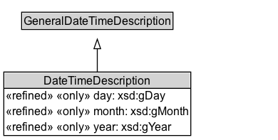

# DateTimeDescription

## Diagram

=== "SVG (interactive)"

    <!-- Generated by graphviz version 14.0.2 (20251019.1705)
     -->
    <!-- Pages: 1 -->
    <svg width="292pt" height="148pt"
     viewBox="0.00 0.00 292.00 148.00" xmlns="http://www.w3.org/2000/svg" xmlns:xlink="http://www.w3.org/1999/xlink">
    <g id="graph0" class="graph" transform="scale(1 1) rotate(0) translate(4 143.5)">
    <polygon fill="white" stroke="none" points="-4,4 -4,-143.5 288.38,-143.5 288.38,4 -4,4"/>
    <g id="clust2" class="cluster">
    <title>cluster_associated</title>
    </g>
    <!-- DateTimeDescription -->
    <g id="node1" class="node">
    <title>DateTimeDescription</title>
    <g id="a_node1"><a xlink:href="../DateTimeDescription" xlink:title="&lt;TABLE&gt;">
    <polygon fill="lightgray" stroke="none" points="1,-50.25 1,-66.5 195.75,-66.5 195.75,-50.25 1,-50.25"/>
    <text xml:space="preserve" text-anchor="start" x="42.12" y="-54.1" font-family="Arial" font-size="12.00">DateTimeDescription</text>
    <text xml:space="preserve" text-anchor="start" x="2" y="-37.85" font-family="Arial" font-size="12.00">«refined» «only» day: xsd:gDay</text>
    <text xml:space="preserve" text-anchor="start" x="2" y="-21.6" font-family="Arial" font-size="12.00">«refined» «only» month: xsd:gMonth</text>
    <text xml:space="preserve" text-anchor="start" x="2" y="-5.35" font-family="Arial" font-size="12.00">«refined» «only» year: xsd:gYear</text>
    <polygon fill="black" stroke="black" points="0,-50.25 0,-50.25 196.75,-50.25 196.75,-50.25 0,-50.25"/>
    <polygon fill="none" stroke="black" points="0,-0.5 0,-67.5 196.75,-67.5 196.75,-0.5 0,-0.5"/>
    </a>
    </g>
    </g>
    <!-- GeneralDateTimeDescription -->
    <g id="node3" class="node">
    <title>GeneralDateTimeDescription</title>
    <g id="a_node3"><a xlink:href="../GeneralDateTimeDescription" xlink:title="&lt;TABLE&gt;">
    <polygon fill="lightgray" stroke="none" points="19.75,-113.38 19.75,-129.62 177,-129.62 177,-113.38 19.75,-113.38"/>
    <text xml:space="preserve" text-anchor="start" x="20.75" y="-117.22" font-family="Arial" font-size="12.00">GeneralDateTimeDescription</text>
    <polygon fill="none" stroke="black" points="18.75,-112.38 18.75,-130.62 178,-130.62 178,-112.38 18.75,-112.38"/>
    </a>
    </g>
    </g>
    <!-- DateTimeDescription&#45;&gt;GeneralDateTimeDescription -->
    <g id="edge1" class="edge">
    <title>DateTimeDescription&#45;&gt;GeneralDateTimeDescription</title>
    <path fill="none" stroke="black" d="M98.38,-67.43C98.38,-75.62 98.38,-84.33 98.38,-92.29"/>
    <polygon fill="none" stroke="black" points="94.88,-92.09 98.38,-102.09 101.88,-92.09 94.88,-92.09"/>
    </g>
    <!-- Invis -->
    </g>
    </svg>

=== "PNG"

    

## Specializations of DateTimeDescription

| Class | Description |
|-------|-------------|
| [January](January.md) |  |

## Formalization for DateTimeDescription

| Property | Constraint |
|----------|------------|
| day | all xsd:gDay |
| hasTRS | has http://www.opengis.net/def/uom/ISO-8601/0/Gregorian |
| month | all xsd:gMonth |
| subClassOf | GeneralDateTimeDescription |
| year | all xsd:gYear |

