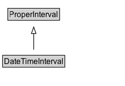

# DateTimeInterval

NOTE: 'intervalo de fecha-hora' se puede utilizar sólo para un intervalo cuyos límites coinciden con un elemento de fecha-hora alineados con el calendario y la zona horaria indicados. Por ejemplo, aunque ambos tienen una duración de un día, el intervalo de 24 horas que empieza en la media noche del comienzo del 8 mayo en Europa Central se puede expresar como un 'intervalo de fecha-hora', el intervalo de 24 horas que empieza a las 1:30pm no.

## Diagram

=== "SVG (interactive)"

    <!-- Generated by graphviz version 14.0.2 (20251019.1705)
     -->
    <!-- Pages: 1 -->
    <svg width="190pt" height="132pt"
     viewBox="0.00 0.00 190.00 132.00" xmlns="http://www.w3.org/2000/svg" xmlns:xlink="http://www.w3.org/1999/xlink">
    <g id="graph0" class="graph" transform="scale(1 1) rotate(0) translate(4 128)">
    <polygon fill="white" stroke="none" points="-4,4 -4,-128 186.38,-128 186.38,4 -4,4"/>
    <g id="clust2" class="cluster">
    <title>cluster_associated</title>
    </g>
    <!-- DateTimeInterval -->
    <g id="node1" class="node">
    <title>DateTimeInterval</title>
    <g id="a_node1"><a xlink:href="../DateTimeInterval" xlink:title="&lt;TABLE&gt;">
    <polygon fill="lightgray" stroke="none" points="1,-25.88 1,-42.12 93.75,-42.12 93.75,-25.88 1,-25.88"/>
    <text xml:space="preserve" text-anchor="start" x="2" y="-29.73" font-family="Arial" font-size="12.00">DateTimeInterval</text>
    <polygon fill="none" stroke="black" points="0,-24.88 0,-43.12 94.75,-43.12 94.75,-24.88 0,-24.88"/>
    </a>
    </g>
    </g>
    <!-- ProperInterval -->
    <g id="node3" class="node">
    <title>ProperInterval</title>
    <g id="a_node3"><a xlink:href="../ProperInterval" xlink:title="&lt;TABLE&gt;">
    <polygon fill="lightgray" stroke="none" points="8.88,-97.88 8.88,-114.12 85.88,-114.12 85.88,-97.88 8.88,-97.88"/>
    <text xml:space="preserve" text-anchor="start" x="9.88" y="-101.72" font-family="Arial" font-size="12.00">ProperInterval</text>
    <polygon fill="none" stroke="black" points="7.88,-96.88 7.88,-115.12 86.88,-115.12 86.88,-96.88 7.88,-96.88"/>
    </a>
    </g>
    </g>
    <!-- DateTimeInterval&#45;&gt;ProperInterval -->
    <g id="edge1" class="edge">
    <title>DateTimeInterval&#45;&gt;ProperInterval</title>
    <path fill="none" stroke="black" d="M47.38,-51.79C47.38,-59.25 47.38,-68.24 47.38,-76.69"/>
    <polygon fill="none" stroke="black" points="43.88,-76.54 47.38,-86.54 50.88,-76.54 43.88,-76.54"/>
    </g>
    <!-- Invis -->
    </g>
    </svg>

=== "PNG"

    

## Formalization for DateTimeInterval

| Property | Constraint |
|----------|------------|
| subClassOf | ProperInterval |

