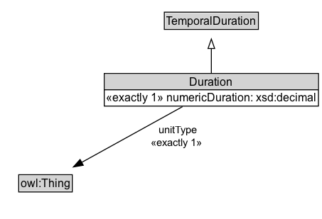

# Duration

NOTE: Alternativa a 'descripción de tiempo' para proporcionar descripción soporte a una duración temporal diferente a utilizar un sistema de calendario/reloj.

## Diagram

=== "SVG (interactive)"

    <!-- Generated by graphviz version 14.0.2 (20251019.1705)
     -->
    <!-- Pages: 1 -->
    <svg width="340pt" height="232pt"
     viewBox="0.00 0.00 340.00 232.00" xmlns="http://www.w3.org/2000/svg" xmlns:xlink="http://www.w3.org/1999/xlink">
    <g id="graph0" class="graph" transform="scale(1 1) rotate(0) translate(4 228)">
    <polygon fill="white" stroke="none" points="-4,4 -4,-228 336,-228 336,4 -4,4"/>
    <g id="clust2" class="cluster">
    <title>cluster_associated</title>
    </g>
    <!-- Duration -->
    <g id="node1" class="node">
    <title>Duration</title>
    <g id="a_node1"><a xlink:href="../Duration" xlink:title="&lt;TABLE&gt;">
    <polygon fill="lightgray" stroke="none" points="107,-133 107,-149.25 331,-149.25 331,-133 107,-133"/>
    <text xml:space="preserve" text-anchor="start" x="196.12" y="-136.85" font-family="Arial" font-size="12.00">Duration</text>
    <text xml:space="preserve" text-anchor="start" x="108" y="-120.6" font-family="Arial" font-size="12.00">«exactly 1» numericDuration: xsd:decimal</text>
    <polygon fill="black" stroke="black" points="106,-133 106,-133 332,-133 332,-133 106,-133"/>
    <polygon fill="none" stroke="black" points="106,-115.75 106,-150.25 332,-150.25 332,-115.75 106,-115.75"/>
    </a>
    </g>
    </g>
    <!-- Invis -->
    <!-- Duration&#45;&gt;Invis -->
    <!-- owl_Thing -->
    <g id="node3" class="node">
    <title>owl_Thing</title>
    <polygon fill="lightgray" stroke="none" points="16.75,-25.88 16.75,-42.12 71.25,-42.12 71.25,-25.88 16.75,-25.88"/>
    <text xml:space="preserve" text-anchor="start" x="17.75" y="-29.73" font-family="Arial" font-size="12.00">owl:Thing</text>
    <polygon fill="none" stroke="black" points="15.75,-24.88 15.75,-43.12 72.25,-43.12 72.25,-24.88 15.75,-24.88"/>
    </g>
    <!-- Duration&#45;&gt;owl_Thing -->
    <g id="edge4" class="edge">
    <title>Duration&#45;&gt;owl_Thing</title>
    <path fill="none" stroke="black" d="M188.52,-115.1C158.92,-98.7 113.89,-73.74 81.98,-56.05"/>
    <polygon fill="black" stroke="black" points="83.88,-53.1 73.43,-51.32 80.48,-59.22 83.88,-53.1"/>
    <text xml:space="preserve" text-anchor="middle" x="183.82" y="-86.55" font-family="Arial" font-size="11.00"> unitType </text>
    <text xml:space="preserve" text-anchor="middle" x="183.82" y="-73.05" font-family="Arial" font-size="11.00"> «exactly 1» &#160;</text>
    </g>
    <!-- TemporalDuration -->
    <g id="node4" class="node">
    <title>TemporalDuration</title>
    <g id="a_node4"><a xlink:href="../TemporalDuration" xlink:title="&lt;TABLE&gt;">
    <polygon fill="lightgray" stroke="none" points="170.38,-197.88 170.38,-214.12 267.62,-214.12 267.62,-197.88 170.38,-197.88"/>
    <text xml:space="preserve" text-anchor="start" x="171.38" y="-201.72" font-family="Arial" font-size="12.00">TemporalDuration</text>
    <polygon fill="none" stroke="black" points="169.38,-196.88 169.38,-215.12 268.62,-215.12 268.62,-196.88 169.38,-196.88"/>
    </a>
    </g>
    </g>
    <!-- Duration&#45;&gt;TemporalDuration -->
    <g id="edge1" class="edge">
    <title>Duration&#45;&gt;TemporalDuration</title>
    <path fill="none" stroke="black" d="M219,-150.71C219,-158.47 219,-167.92 219,-176.74"/>
    <polygon fill="none" stroke="black" points="215.5,-176.66 219,-186.66 222.5,-176.66 215.5,-176.66"/>
    </g>
    <!-- Invis&#45;&gt;owl_Thing -->
    </g>
    </svg>

=== "PNG"

    

## Formalization for Duration

| Property | Constraint |
|----------|------------|
| numericDuration | exactly 1 owl:Thing |
| subClassOf | TemporalDuration |
| unitType | exactly 1 owl:Thing |

