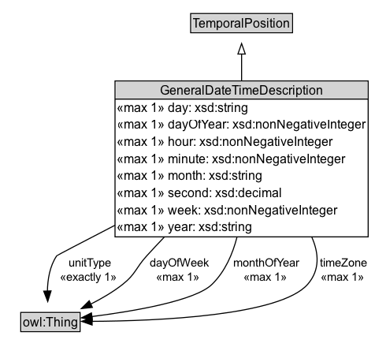

# GeneralDateTimeDescription

NOTE: Algunas combinaciones de propiedades son redundantes - por ejemplo, dentro de un 'año' especificado si se proporciona 'día del año' entonces 'día' y 'mes' se pueden computar, y viceversa. Los valores individuales deberían ser consistentes entre ellos y con el calendario, indicado a través del valor de la propiedad 'tiene TRS'.

## Diagram

=== "SVG (interactive)"

    <!-- Generated by graphviz version 14.0.2 (20251019.1705)
     -->
    <!-- Pages: 1 -->
    <svg width="357pt" height="344pt"
     viewBox="0.00 0.00 357.00 344.00" xmlns="http://www.w3.org/2000/svg" xmlns:xlink="http://www.w3.org/1999/xlink">
    <g id="graph0" class="graph" transform="scale(1 1) rotate(0) translate(4 340.25)">
    <polygon fill="white" stroke="none" points="-4,4 -4,-340.25 352.88,-340.25 352.88,4 -4,4"/>
    <g id="clust2" class="cluster">
    <title>cluster_associated</title>
    </g>
    <!-- GeneralDateTimeDescription -->
    <g id="node1" class="node">
    <title>GeneralDateTimeDescription</title>
    <g id="a_node1"><a xlink:href="../GeneralDateTimeDescription" xlink:title="&lt;TABLE&gt;">
    <polygon fill="lightgray" stroke="none" points="106.5,-246 106.5,-262.25 345.5,-262.25 345.5,-246 106.5,-246"/>
    <text xml:space="preserve" text-anchor="start" x="148.38" y="-249.85" font-family="Arial" font-size="12.00">GeneralDateTimeDescription</text>
    <text xml:space="preserve" text-anchor="start" x="107.5" y="-233.6" font-family="Arial" font-size="12.00">«max 1» day: xsd:string</text>
    <text xml:space="preserve" text-anchor="start" x="107.5" y="-217.35" font-family="Arial" font-size="12.00">«max 1» dayOfYear: xsd:nonNegativeInteger</text>
    <text xml:space="preserve" text-anchor="start" x="107.5" y="-201.1" font-family="Arial" font-size="12.00">«max 1» hour: xsd:nonNegativeInteger</text>
    <text xml:space="preserve" text-anchor="start" x="107.5" y="-184.85" font-family="Arial" font-size="12.00">«max 1» minute: xsd:nonNegativeInteger</text>
    <text xml:space="preserve" text-anchor="start" x="107.5" y="-168.6" font-family="Arial" font-size="12.00">«max 1» month: xsd:string</text>
    <text xml:space="preserve" text-anchor="start" x="107.5" y="-152.35" font-family="Arial" font-size="12.00">«max 1» second: xsd:decimal</text>
    <text xml:space="preserve" text-anchor="start" x="107.5" y="-136.1" font-family="Arial" font-size="12.00">«max 1» week: xsd:nonNegativeInteger</text>
    <text xml:space="preserve" text-anchor="start" x="107.5" y="-119.85" font-family="Arial" font-size="12.00">«max 1» year: xsd:string</text>
    <polygon fill="black" stroke="black" points="105.5,-246 105.5,-246 346.5,-246 346.5,-246 105.5,-246"/>
    <polygon fill="none" stroke="black" points="105.5,-115 105.5,-263.25 346.5,-263.25 346.5,-115 105.5,-115"/>
    </a>
    </g>
    </g>
    <!-- Invis -->
    <!-- GeneralDateTimeDescription&#45;&gt;Invis -->
    <!-- owl_Thing -->
    <g id="node3" class="node">
    <title>owl_Thing</title>
    <polygon fill="lightgray" stroke="none" points="16.75,-25.88 16.75,-42.12 71.25,-42.12 71.25,-25.88 16.75,-25.88"/>
    <text xml:space="preserve" text-anchor="start" x="17.75" y="-29.73" font-family="Arial" font-size="12.00">owl:Thing</text>
    <polygon fill="none" stroke="black" points="15.75,-24.88 15.75,-43.12 72.25,-43.12 72.25,-24.88 15.75,-24.88"/>
    </g>
    <!-- GeneralDateTimeDescription&#45;&gt;owl_Thing -->
    <g id="edge4" class="edge">
    <title>GeneralDateTimeDescription&#45;&gt;owl_Thing</title>
    <path fill="none" stroke="black" d="M105.54,-126.08C74.85,-110.21 50.29,-97.43 50,-97 43.39,-87.23 41.32,-74.52 41.13,-63.16"/>
    <polygon fill="black" stroke="black" points="44.62,-63.61 41.44,-53.5 37.62,-63.38 44.62,-63.61"/>
    <text xml:space="preserve" text-anchor="middle" x="81.5" y="-86.55" font-family="Arial" font-size="11.00"> unitType </text>
    <text xml:space="preserve" text-anchor="middle" x="81.5" y="-73.05" font-family="Arial" font-size="11.00"> «exactly 1» &#160;</text>
    </g>
    <!-- GeneralDateTimeDescription&#45;&gt;owl_Thing -->
    <g id="edge5" class="edge">
    <title>GeneralDateTimeDescription&#45;&gt;owl_Thing</title>
    <path fill="none" stroke="black" d="M152.58,-115.01C146.83,-108.97 141.16,-102.92 135.75,-97 125.16,-85.42 125.3,-79.74 113,-70 103.76,-62.68 92.75,-56.27 82.26,-51"/>
    <polygon fill="black" stroke="black" points="83.94,-47.92 73.41,-46.77 80.93,-54.24 83.94,-47.92"/>
    <text xml:space="preserve" text-anchor="middle" x="166.88" y="-86.55" font-family="Arial" font-size="11.00"> dayOfWeek </text>
    <text xml:space="preserve" text-anchor="middle" x="166.88" y="-73.05" font-family="Arial" font-size="11.00"> «max 1» &#160;</text>
    </g>
    <!-- GeneralDateTimeDescription&#45;&gt;owl_Thing -->
    <g id="edge6" class="edge">
    <title>GeneralDateTimeDescription&#45;&gt;owl_Thing</title>
    <path fill="none" stroke="black" d="M221.72,-115.15C217.47,-98.45 210.2,-82.09 198,-70 182.05,-54.19 123.44,-44.28 83.31,-39.2"/>
    <polygon fill="black" stroke="black" points="83.88,-35.74 73.53,-38.01 83.03,-42.69 83.88,-35.74"/>
    <text xml:space="preserve" text-anchor="middle" x="250.13" y="-86.55" font-family="Arial" font-size="11.00"> monthOfYear </text>
    <text xml:space="preserve" text-anchor="middle" x="250.13" y="-73.05" font-family="Arial" font-size="11.00"> «max 1» &#160;</text>
    </g>
    <!-- GeneralDateTimeDescription&#45;&gt;owl_Thing -->
    <g id="edge7" class="edge">
    <title>GeneralDateTimeDescription&#45;&gt;owl_Thing</title>
    <path fill="none" stroke="black" d="M292.67,-115.15C299.71,-99.38 300.65,-83.43 289,-70 262.88,-39.89 145.93,-35.04 83.53,-34.65"/>
    <polygon fill="black" stroke="black" points="83.7,-31.15 73.69,-34.63 83.68,-38.15 83.7,-31.15"/>
    <text xml:space="preserve" text-anchor="middle" x="323.38" y="-86.55" font-family="Arial" font-size="11.00"> timeZone </text>
    <text xml:space="preserve" text-anchor="middle" x="323.38" y="-73.05" font-family="Arial" font-size="11.00"> «max 1» &#160;</text>
    </g>
    <!-- TemporalPosition -->
    <g id="node4" class="node">
    <title>TemporalPosition</title>
    <g id="a_node4"><a xlink:href="../TemporalPosition" xlink:title="&lt;TABLE&gt;">
    <polygon fill="lightgray" stroke="none" points="178.5,-310.12 178.5,-326.38 273.5,-326.38 273.5,-310.12 178.5,-310.12"/>
    <text xml:space="preserve" text-anchor="start" x="179.5" y="-313.98" font-family="Arial" font-size="12.00">TemporalPosition</text>
    <polygon fill="none" stroke="black" points="177.5,-309.12 177.5,-327.38 274.5,-327.38 274.5,-309.12 177.5,-309.12"/>
    </a>
    </g>
    </g>
    <!-- GeneralDateTimeDescription&#45;&gt;TemporalPosition -->
    <g id="edge1" class="edge">
    <title>GeneralDateTimeDescription&#45;&gt;TemporalPosition</title>
    <path fill="none" stroke="black" d="M226,-263.19C226,-272.33 226,-281.21 226,-289.04"/>
    <polygon fill="none" stroke="black" points="222.5,-288.86 226,-298.86 229.5,-288.86 222.5,-288.86"/>
    </g>
    <!-- Invis&#45;&gt;owl_Thing -->
    </g>
    </svg>

=== "PNG"

    

## Specializations of GeneralDateTimeDescription

| Class | Description |
|-------|-------------|
| [January](January.md) |  |

## Formalization for GeneralDateTimeDescription

| Property | Constraint |
|----------|------------|
| day | max 1 owl:Thing |
| dayOfWeek | max 1 owl:Thing |
| dayOfYear | max 1 owl:Thing |
| hour | max 1 owl:Thing |
| minute | max 1 owl:Thing |
| month | max 1 owl:Thing |
| monthOfYear | max 1 owl:Thing |
| second | max 1 owl:Thing |
| subClassOf | TemporalPosition |
| timeZone | max 1 owl:Thing |
| unitType | exactly 1 owl:Thing |
| week | max 1 owl:Thing |
| year | max 1 owl:Thing |

