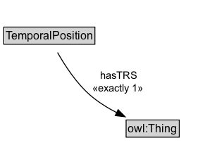

# TemporalPosition

## Diagram

=== "SVG (interactive)"

    <!-- Generated by graphviz version 14.0.2 (20251019.1705)
     -->
    <!-- Pages: 1 -->
    <svg width="211pt" height="175pt"
     viewBox="0.00 0.00 211.00 175.00" xmlns="http://www.w3.org/2000/svg" xmlns:xlink="http://www.w3.org/1999/xlink">
    <g id="graph0" class="graph" transform="scale(1 1) rotate(0) translate(4 171)">
    <polygon fill="white" stroke="none" points="-4,4 -4,-171 206.5,-171 206.5,4 -4,4"/>
    <g id="clust2" class="cluster">
    <title>cluster_associated</title>
    </g>
    <!-- TemporalPosition -->
    <g id="node1" class="node">
    <title>TemporalPosition</title>
    <g id="a_node1"><a xlink:href="../TemporalPosition" xlink:title="&lt;TABLE&gt;">
    <polygon fill="lightgray" stroke="none" points="1,-124.88 1,-141.12 96,-141.12 96,-124.88 1,-124.88"/>
    <text xml:space="preserve" text-anchor="start" x="2" y="-128.72" font-family="Arial" font-size="12.00">TemporalPosition</text>
    <polygon fill="none" stroke="black" points="0,-123.88 0,-142.12 97,-142.12 97,-123.88 0,-123.88"/>
    </a>
    </g>
    </g>
    <!-- Invis -->
    <!-- TemporalPosition&#45;&gt;Invis -->
    <!-- owl_Thing -->
    <g id="node3" class="node">
    <title>owl_Thing</title>
    <polygon fill="lightgray" stroke="none" points="131.25,-25.88 131.25,-42.12 185.75,-42.12 185.75,-25.88 131.25,-25.88"/>
    <text xml:space="preserve" text-anchor="start" x="132.25" y="-29.73" font-family="Arial" font-size="12.00">owl:Thing</text>
    <polygon fill="none" stroke="black" points="130.25,-24.88 130.25,-43.12 186.75,-43.12 186.75,-24.88 130.25,-24.88"/>
    </g>
    <!-- TemporalPosition&#45;&gt;owl_Thing -->
    <g id="edge3" class="edge">
    <title>TemporalPosition&#45;&gt;owl_Thing</title>
    <path fill="none" stroke="black" d="M57.24,-115.05C64.86,-101.54 76.96,-82.83 91.5,-70 99.97,-62.53 110.32,-56.12 120.33,-50.91"/>
    <polygon fill="black" stroke="black" points="121.74,-54.12 129.19,-46.58 118.66,-47.83 121.74,-54.12"/>
    <text xml:space="preserve" text-anchor="middle" x="123" y="-86.55" font-family="Arial" font-size="11.00"> hasTRS </text>
    <text xml:space="preserve" text-anchor="middle" x="123" y="-73.05" font-family="Arial" font-size="11.00"> «exactly 1» &#160;</text>
    </g>
    <!-- Invis&#45;&gt;owl_Thing -->
    </g>
    </svg>

=== "PNG"

    

## Specializations of TemporalPosition

| Class | Description |
|-------|-------------|
| [January](January.md) |  |

## Formalization for TemporalPosition

| Property | Constraint |
|----------|------------|
| hasTRS | exactly 1 owl:Thing |

