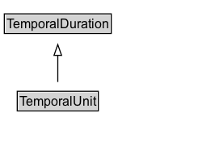

# TemporalUnit

NOTE: La pertenencia de la clase 'unidad de tiempo' está abierta, para permitir otras unidades de tiempo utilizadas en algunas aplicaciones técnicas (por ejemplo, millones de años o el mes Baha'i).

## Diagram

=== "SVG (interactive)"

    <!-- Generated by graphviz version 14.0.2 (20251019.1705)
     -->
    <!-- Pages: 1 -->
    <svg width="184pt" height="132pt"
     viewBox="0.00 0.00 184.00 132.00" xmlns="http://www.w3.org/2000/svg" xmlns:xlink="http://www.w3.org/1999/xlink">
    <g id="graph0" class="graph" transform="scale(1 1) rotate(0) translate(4 128)">
    <polygon fill="white" stroke="none" points="-4,4 -4,-128 179.62,-128 179.62,4 -4,4"/>
    <g id="clust2" class="cluster">
    <title>cluster_associated</title>
    </g>
    <!-- TemporalUnit -->
    <g id="node1" class="node">
    <title>TemporalUnit</title>
    <g id="a_node1"><a xlink:href="../TemporalUnit" xlink:title="&lt;TABLE&gt;">
    <polygon fill="lightgray" stroke="none" points="13,-25.88 13,-42.12 86.25,-42.12 86.25,-25.88 13,-25.88"/>
    <text xml:space="preserve" text-anchor="start" x="14" y="-29.73" font-family="Arial" font-size="12.00">TemporalUnit</text>
    <polygon fill="none" stroke="black" points="12,-24.88 12,-43.12 87.25,-43.12 87.25,-24.88 12,-24.88"/>
    </a>
    </g>
    </g>
    <!-- TemporalDuration -->
    <g id="node3" class="node">
    <title>TemporalDuration</title>
    <g id="a_node3"><a xlink:href="../TemporalDuration" xlink:title="&lt;TABLE&gt;">
    <polygon fill="lightgray" stroke="none" points="1,-97.88 1,-114.12 98.25,-114.12 98.25,-97.88 1,-97.88"/>
    <text xml:space="preserve" text-anchor="start" x="2" y="-101.72" font-family="Arial" font-size="12.00">TemporalDuration</text>
    <polygon fill="none" stroke="black" points="0,-96.88 0,-115.12 99.25,-115.12 99.25,-96.88 0,-96.88"/>
    </a>
    </g>
    </g>
    <!-- TemporalUnit&#45;&gt;TemporalDuration -->
    <g id="edge1" class="edge">
    <title>TemporalUnit&#45;&gt;TemporalDuration</title>
    <path fill="none" stroke="black" d="M49.62,-51.79C49.62,-59.25 49.62,-68.24 49.62,-76.69"/>
    <polygon fill="none" stroke="black" points="46.13,-76.54 49.63,-86.54 53.13,-76.54 46.13,-76.54"/>
    </g>
    <!-- Invis -->
    </g>
    </svg>

=== "PNG"

    

## Formalization for TemporalUnit

| Property | Constraint |
|----------|------------|
| subClassOf | TemporalDuration |

## Other annotations

| Property | Value |
|----------|-------|
| skos:changeNote | Remove enumeration from definition, in order to allow other units to be used when required in other coordinate systems. 
NOTE: existing units are still present as members of the class, but the class membership is now open. 

In the original OWL-Time the following constraint appeared: 
  owl:oneOf (
      time:unitSecond
      time:unitMinute
      time:unitHour
      time:unitDay
      time:unitWeek
      time:unitMonth
      time:unitYear
    ) ; |

