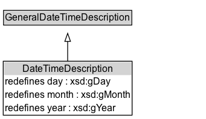

# DateTimeDescription

Description of date and time structured with separate values for the various elements of a calendar-clock system. The temporal reference system is fixed to Gregorian Calendar, and the range of year, month, day properties restricted to corresponding XML Schema types xsd:gYear, xsd:gMonth and xsd:gDay, respectively.

## Diagram

=== "SVG (interactive)"

    <!-- Generated by graphviz version 14.1.3 (20260303.0454)
     -->
    <!-- Pages: 1 -->
    <svg width="256pt" height="148pt"
     viewBox="0.00 0.00 256.00 148.00" xmlns="http://www.w3.org/2000/svg" xmlns:xlink="http://www.w3.org/1999/xlink">
    <g id="graph0" class="graph" transform="scale(1 1) rotate(0) translate(4 143.5)">
    <polygon fill="white" stroke="none" points="-4,4 -4,-143.5 252,-143.5 252,4 -4,4"/>
    <g id="clust3" class="cluster">
    <title>cluster_associated</title>
    </g>
    <!-- GeneralDateTimeDescription -->
    <g id="node1" class="node">
    <title>GeneralDateTimeDescription</title>
    <g id="a_node1"><a xlink:href="../GeneralDateTimeDescription" xlink:title="&lt;TABLE&gt;">
    <polygon fill="lightgray" stroke="none" points="1.38,-113.38 1.38,-129.62 158.62,-129.62 158.62,-113.38 1.38,-113.38"/>
    <text xml:space="preserve" text-anchor="start" x="2.38" y="-117.38" font-family="Arial" font-size="12.00">GeneralDateTimeDescription</text>
    <polygon fill="none" stroke="black" points="0.38,-112.38 0.38,-130.62 159.62,-130.62 159.62,-112.38 0.38,-112.38"/>
    </a>
    </g>
    </g>
    <!-- DateTimeDescription -->
    <g id="node2" class="node">
    <title>DateTimeDescription</title>
    <g id="a_node2"><a xlink:href="../DateTimeDescription" xlink:title="&lt;TABLE&gt;">
    <polygon fill="lightgray" stroke="none" points="1,-50.25 1,-66.5 159,-66.5 159,-50.25 1,-50.25"/>
    <text xml:space="preserve" text-anchor="start" x="23.75" y="-54.25" font-family="Arial" font-size="12.00">DateTimeDescription</text>
    <text xml:space="preserve" text-anchor="start" x="2" y="-38" font-family="Arial" font-size="12.00">redefines day : xsd:gDay</text>
    <text xml:space="preserve" text-anchor="start" x="2" y="-21.75" font-family="Arial" font-size="12.00">redefines month : xsd:gMonth</text>
    <text xml:space="preserve" text-anchor="start" x="2" y="-5.5" font-family="Arial" font-size="12.00">redefines year : xsd:gYear</text>
    <polygon fill="none" stroke="black" points="0,-0.5 0,-67.5 160,-67.5 160,-0.5 0,-0.5"/>
    </a>
    </g>
    </g>
    <!-- DateTimeDescription&#45;&gt;GeneralDateTimeDescription -->
    <g id="edge1" class="edge">
    <title>DateTimeDescription&#45;&gt;GeneralDateTimeDescription</title>
    <path fill="none" stroke="black" d="M80,-67.43C80,-75.62 80,-84.33 80,-92.29"/>
    <polygon fill="none" stroke="black" points="76.5,-92.09 80,-102.09 83.5,-92.09 76.5,-92.09"/>
    </g>
    <!-- Invis -->
    </g>
    </svg>

=== "PNG"

    

## Specializations of DateTimeDescription

| Class | Description |
|-------|-------------|
| [January](January.md) |  |
| [Month Of Year](MonthOfYear.md) | The month of the year |

## Formalization for DateTimeDescription

| Property | Constraint |
|----------|------------|
| [day](../properties/day.md) | only [xsd:gDay](https://w3id.org/citydata/imported/xsd/gDay) |
| [hasTRS](../properties/hasTRS.md) | value [iso8601:Gregorian](http://www.opengis.net/def/uom/ISO-8601/0/Gregorian) |
| [month](../properties/month.md) | only [xsd:gMonth](https://w3id.org/citydata/imported/xsd/gMonth) |
| [year](../properties/year.md) | only [xsd:gYear](https://w3id.org/citydata/imported/xsd/gYear) |
| subClassOf | [GeneralDateTimeDescription](GeneralDateTimeDescription.md) |

