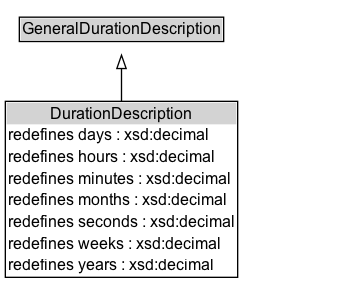

# DurationDescription

Description of temporal extent structured with separate values for the various elements of a calendar-clock system. The temporal reference system is fixed to Gregorian Calendar, and the range of each of the numeric properties is restricted to xsd:decimal

NOTE: In the Gregorian calendar the length of the month is not fixed. Therefore, a value like "2.5 months" cannot be exactly compared with a similar duration expressed in terms of weeks or days.

## Diagram

=== "SVG (interactive)"

    <!-- Generated by graphviz version 14.1.3 (20260303.0454)
     -->
    <!-- Pages: 1 -->
    <svg width="270pt" height="212pt"
     viewBox="0.00 0.00 270.00 212.00" xmlns="http://www.w3.org/2000/svg" xmlns:xlink="http://www.w3.org/1999/xlink">
    <g id="graph0" class="graph" transform="scale(1 1) rotate(0) translate(4 208)">
    <polygon fill="white" stroke="none" points="-4,4 -4,-208 266.12,-208 266.12,4 -4,4"/>
    <g id="clust3" class="cluster">
    <title>cluster_associated</title>
    </g>
    <!-- GeneralDurationDescription -->
    <g id="node1" class="node">
    <title>GeneralDurationDescription</title>
    <g id="a_node1"><a xlink:href="../GeneralDurationDescription" xlink:title="&lt;TABLE&gt;">
    <polygon fill="lightgray" stroke="none" points="11.5,-177.88 11.5,-194.12 162.75,-194.12 162.75,-177.88 11.5,-177.88"/>
    <text xml:space="preserve" text-anchor="start" x="12.5" y="-181.88" font-family="Arial" font-size="12.00">GeneralDurationDescription</text>
    <polygon fill="none" stroke="black" points="10.5,-176.88 10.5,-195.12 163.75,-195.12 163.75,-176.88 10.5,-176.88"/>
    </a>
    </g>
    </g>
    <!-- DurationDescription -->
    <g id="node2" class="node">
    <title>DurationDescription</title>
    <g id="a_node2"><a xlink:href="../DurationDescription" xlink:title="&lt;TABLE&gt;">
    <polygon fill="lightgray" stroke="none" points="1,-114.75 1,-131 173.25,-131 173.25,-114.75 1,-114.75"/>
    <text xml:space="preserve" text-anchor="start" x="33.88" y="-118.75" font-family="Arial" font-size="12.00">DurationDescription</text>
    <text xml:space="preserve" text-anchor="start" x="2" y="-102.5" font-family="Arial" font-size="12.00">redefines days : xsd:decimal</text>
    <text xml:space="preserve" text-anchor="start" x="2" y="-86.25" font-family="Arial" font-size="12.00">redefines hours : xsd:decimal</text>
    <text xml:space="preserve" text-anchor="start" x="2" y="-70" font-family="Arial" font-size="12.00">redefines minutes : xsd:decimal</text>
    <text xml:space="preserve" text-anchor="start" x="2" y="-53.75" font-family="Arial" font-size="12.00">redefines months : xsd:decimal</text>
    <text xml:space="preserve" text-anchor="start" x="2" y="-37.5" font-family="Arial" font-size="12.00">redefines seconds : xsd:decimal</text>
    <text xml:space="preserve" text-anchor="start" x="2" y="-21.25" font-family="Arial" font-size="12.00">redefines weeks : xsd:decimal</text>
    <text xml:space="preserve" text-anchor="start" x="2" y="-5" font-family="Arial" font-size="12.00">redefines years : xsd:decimal</text>
    <polygon fill="none" stroke="black" points="0,0 0,-132 174.25,-132 174.25,0 0,0"/>
    </a>
    </g>
    </g>
    <!-- DurationDescription&#45;&gt;GeneralDurationDescription -->
    <g id="edge1" class="edge">
    <title>DurationDescription&#45;&gt;GeneralDurationDescription</title>
    <path fill="none" stroke="black" d="M87.12,-131.76C87.12,-140.49 87.12,-149.05 87.12,-156.66"/>
    <polygon fill="none" stroke="black" points="83.63,-156.58 87.13,-166.58 90.63,-156.58 83.63,-156.58"/>
    </g>
    <!-- Invis -->
    </g>
    </svg>

=== "PNG"

    

## Specializations of DurationDescription

| Class | Description |
|-------|-------------|
| [Year](Year.md) | Year duration |

## Formalization for DurationDescription

| Property | Constraint |
|----------|------------|
| [days](../properties/days.md) | only [xsd:decimal](https://w3id.org/citydata/imported/xsd/decimal) |
| [hasTRS](../properties/hasTRS.md) | value [iso8601:Gregorian](http://www.opengis.net/def/uom/ISO-8601/0/Gregorian) |
| [hours](../properties/hours.md) | only [xsd:decimal](https://w3id.org/citydata/imported/xsd/decimal) |
| [minutes](../properties/minutes.md) | only [xsd:decimal](https://w3id.org/citydata/imported/xsd/decimal) |
| [months](../properties/months.md) | only [xsd:decimal](https://w3id.org/citydata/imported/xsd/decimal) |
| [seconds](../properties/seconds.md) | only [xsd:decimal](https://w3id.org/citydata/imported/xsd/decimal) |
| [weeks](../properties/weeks.md) | only [xsd:decimal](https://w3id.org/citydata/imported/xsd/decimal) |
| [years](../properties/years.md) | only [xsd:decimal](https://w3id.org/citydata/imported/xsd/decimal) |
| subClassOf | [GeneralDurationDescription](GeneralDurationDescription.md) |

