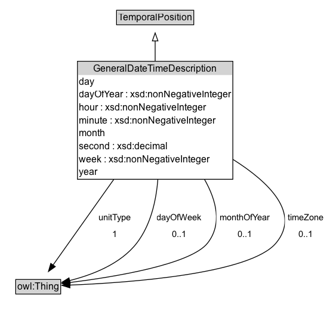

# GeneralDateTimeDescription

Description of date and time structured with separate values for the various elements of a calendar-clock system

NOTE: Some combinations of properties are redundant - for example, within a specified :year if :dayOfYear is provided then :day and :month can be computed, and vice versa. Individual values should be consistent with each other and the calendar, indicated through the value of the :hasTRS property.

## Diagram

=== "SVG (interactive)"

    <!-- Generated by graphviz version 14.1.3 (20260303.0454)
     -->
    <!-- Pages: 1 -->
    <svg width="415pt" height="398pt"
     viewBox="0.00 0.00 415.00 398.00" xmlns="http://www.w3.org/2000/svg" xmlns:xlink="http://www.w3.org/1999/xlink">
    <g id="graph0" class="graph" transform="scale(1 1) rotate(0) translate(4 394.25)">
    <polygon fill="white" stroke="none" points="-4,4 -4,-394.25 411.05,-394.25 411.05,4 -4,4"/>
    <g id="clust3" class="cluster">
    <title>cluster_associated</title>
    </g>
    <!-- TemporalPosition -->
    <g id="node1" class="node">
    <title>TemporalPosition</title>
    <g id="a_node1"><a xlink:href="../TemporalPosition" xlink:title="&lt;TABLE&gt;">
    <polygon fill="lightgray" stroke="none" points="143.5,-364.12 143.5,-380.38 238.5,-380.38 238.5,-364.12 143.5,-364.12"/>
    <text xml:space="preserve" text-anchor="start" x="144.5" y="-368.12" font-family="Arial" font-size="12.00">TemporalPosition</text>
    <polygon fill="none" stroke="black" points="142.5,-363.12 142.5,-381.38 239.5,-381.38 239.5,-363.12 142.5,-363.12"/>
    </a>
    </g>
    </g>
    <!-- GeneralDateTimeDescription -->
    <g id="node2" class="node">
    <title>GeneralDateTimeDescription</title>
    <g id="a_node2"><a xlink:href="../GeneralDateTimeDescription" xlink:title="&lt;TABLE&gt;">
    <polygon fill="lightgray" stroke="none" points="94.38,-300 94.38,-316.25 287.62,-316.25 287.62,-300 94.38,-300"/>
    <text xml:space="preserve" text-anchor="start" x="113.38" y="-304" font-family="Arial" font-size="12.00">GeneralDateTimeDescription</text>
    <text xml:space="preserve" text-anchor="start" x="95.38" y="-287.75" font-family="Arial" font-size="12.00">day</text>
    <text xml:space="preserve" text-anchor="start" x="95.38" y="-271.5" font-family="Arial" font-size="12.00">dayOfYear : xsd:nonNegativeInteger</text>
    <text xml:space="preserve" text-anchor="start" x="95.38" y="-255.25" font-family="Arial" font-size="12.00">hour : xsd:nonNegativeInteger</text>
    <text xml:space="preserve" text-anchor="start" x="95.38" y="-239" font-family="Arial" font-size="12.00">minute : xsd:nonNegativeInteger</text>
    <text xml:space="preserve" text-anchor="start" x="95.38" y="-222.75" font-family="Arial" font-size="12.00">month</text>
    <text xml:space="preserve" text-anchor="start" x="95.38" y="-206.5" font-family="Arial" font-size="12.00">second : xsd:decimal</text>
    <text xml:space="preserve" text-anchor="start" x="95.38" y="-190.25" font-family="Arial" font-size="12.00">week : xsd:nonNegativeInteger</text>
    <text xml:space="preserve" text-anchor="start" x="95.38" y="-174" font-family="Arial" font-size="12.00">year</text>
    <polygon fill="none" stroke="black" points="93.38,-169 93.38,-317.25 288.62,-317.25 288.62,-169 93.38,-169"/>
    </a>
    </g>
    </g>
    <!-- GeneralDateTimeDescription&#45;&gt;TemporalPosition -->
    <g id="edge1" class="edge">
    <title>GeneralDateTimeDescription&#45;&gt;TemporalPosition</title>
    <path fill="none" stroke="black" d="M191,-317.19C191,-326.33 191,-335.21 191,-343.04"/>
    <polygon fill="none" stroke="black" points="187.5,-342.86 191,-352.86 194.5,-342.86 187.5,-342.86"/>
    </g>
    <!-- Invis -->
    <!-- GeneralDateTimeDescription&#45;&gt;Invis -->
    <!-- owl_Thing -->
    <g id="node4" class="node">
    <title>owl_Thing</title>
    <g id="a_node4"><a xlink:href="https://w3id.org/citydata/imported/owl/latest/Thing" xlink:title="&lt;TABLE&gt;">
    <polygon fill="lightgray" stroke="none" points="16.75,-25.88 16.75,-42.12 71.25,-42.12 71.25,-25.88 16.75,-25.88"/>
    <text xml:space="preserve" text-anchor="start" x="17.75" y="-29.88" font-family="Arial" font-size="12.00">owl:Thing</text>
    <polygon fill="none" stroke="black" points="15.75,-24.88 15.75,-43.12 72.25,-43.12 72.25,-24.88 15.75,-24.88"/>
    </a>
    </g>
    </g>
    <!-- GeneralDateTimeDescription&#45;&gt;owl_Thing -->
    <g id="edge4" class="edge">
    <title>GeneralDateTimeDescription&#45;&gt;owl_Thing</title>
    <path fill="none" stroke="black" d="M139.17,-169.1C112.52,-131.55 81.7,-88.12 62.52,-61.1"/>
    <polygon fill="black" stroke="black" points="65.53,-59.29 56.89,-53.16 59.82,-63.34 65.53,-59.29"/>
    <polygon fill="white" stroke="none" points="115.66,-89 115.66,-132 164.16,-132 164.16,-89 115.66,-89"/>
    <text xml:space="preserve" text-anchor="start" x="119.66" y="-117.5" font-family="Arial" font-size="11.00">unitType</text>
    <text xml:space="preserve" text-anchor="start" x="136.91" y="-96" font-family="Arial" font-size="11.00">1</text>
    </g>
    <!-- GeneralDateTimeDescription&#45;&gt;owl_Thing -->
    <g id="edge5" class="edge">
    <title>GeneralDateTimeDescription&#45;&gt;owl_Thing</title>
    <path fill="none" stroke="black" d="M194.43,-169.3C192.27,-141.74 185.35,-111.61 168,-89 147.58,-62.4 111.35,-48.67 83.31,-41.73"/>
    <polygon fill="black" stroke="black" points="84.25,-38.36 73.72,-39.57 82.7,-45.18 84.25,-38.36"/>
    <polygon fill="white" stroke="none" points="188.99,-89 188.99,-132 253.24,-132 253.24,-89 188.99,-89"/>
    <text xml:space="preserve" text-anchor="start" x="192.99" y="-117.5" font-family="Arial" font-size="11.00">dayOfWeek</text>
    <text xml:space="preserve" text-anchor="start" x="212.12" y="-96" font-family="Arial" font-size="11.00">0..1</text>
    </g>
    <!-- GeneralDateTimeDescription&#45;&gt;owl_Thing -->
    <g id="edge6" class="edge">
    <title>GeneralDateTimeDescription&#45;&gt;owl_Thing</title>
    <path fill="none" stroke="black" d="M252.95,-169.02C268.13,-142.2 275.4,-112.65 257,-89 235.89,-61.88 138.98,-46.18 83.43,-39.27"/>
    <polygon fill="black" stroke="black" points="84.09,-35.82 73.75,-38.1 83.26,-42.77 84.09,-35.82"/>
    <polygon fill="white" stroke="none" points="267.91,-89 267.91,-132 338.91,-132 338.91,-89 267.91,-89"/>
    <text xml:space="preserve" text-anchor="start" x="271.91" y="-117.5" font-family="Arial" font-size="11.00">monthOfYear</text>
    <text xml:space="preserve" text-anchor="start" x="294.41" y="-96" font-family="Arial" font-size="11.00">0..1</text>
    </g>
    <!-- GeneralDateTimeDescription&#45;&gt;owl_Thing -->
    <g id="edge7" class="edge">
    <title>GeneralDateTimeDescription&#45;&gt;owl_Thing</title>
    <path fill="none" stroke="black" d="M288.62,-194.09C334.86,-164.93 373.91,-126.26 343,-89 310.48,-49.79 156.8,-39.01 83.32,-36.08"/>
    <polygon fill="black" stroke="black" points="83.88,-32.59 73.76,-35.72 83.62,-39.59 83.88,-32.59"/>
    <polygon fill="white" stroke="none" points="354.05,-89 354.05,-132 407.05,-132 407.05,-89 354.05,-89"/>
    <text xml:space="preserve" text-anchor="start" x="358.05" y="-117.5" font-family="Arial" font-size="11.00">timeZone</text>
    <text xml:space="preserve" text-anchor="start" x="371.55" y="-96" font-family="Arial" font-size="11.00">0..1</text>
    </g>
    <!-- Invis&#45;&gt;owl_Thing -->
    </g>
    </svg>

=== "PNG"

    

## Specializations of GeneralDateTimeDescription

| Class | Description |
|-------|-------------|
| [Date Time Description](DateTimeDescription.md) | Description of date and time structured with separate values for the various elements of a calendar-clock system. The temporal reference system is fixed to Gregorian Calendar, and the range of year, month, day properties restricted to corresponding XML Schema types xsd:gYear, xsd:gMonth and xsd:gDay, respectively. |
| [January](January.md) |  |
| [Month Of Year](MonthOfYear.md) | The month of the year |

## Formalization for GeneralDateTimeDescription

| Property | Constraint |
|----------|------------|
| [day](../properties/day.md) | max 1 |
| [dayOfWeek](../properties/dayOfWeek.md) | max 1 |
| [dayOfYear](../properties/dayOfYear.md) | max 1 |
| [hour](../properties/hour.md) | max 1 |
| [minute](../properties/minute.md) | max 1 |
| [month](../properties/month.md) | max 1 |
| [monthOfYear](../properties/monthOfYear.md) | max 1 |
| [second](../properties/second.md) | max 1 |
| [timeZone](../properties/timeZone.md) | max 1 |
| [unitType](../properties/unitType.md) | exactly 1 |
| [week](../properties/week.md) | max 1 |
| [year](../properties/year.md) | max 1 |
| subClassOf | [TemporalPosition](TemporalPosition.md) |

