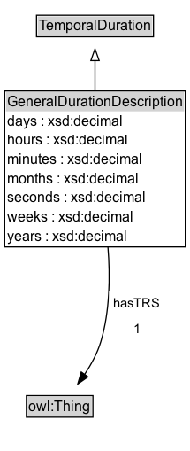

# GeneralDurationDescription

Description of temporal extent structured with separate values for the various elements of a calendar-clock system.

NOTE: The extent of a time duration expressed as a GeneralDurationDescription depends on the Temporal Reference System. In some calendars the length of the week or month is not constant within the year. Therefore, a value like "2.5 months" may not necessarily be exactly compared with a similar duration expressed in terms of weeks or days. When non-earth-based calendars are considered even more care must be taken in comparing durations.

## Diagram

=== "SVG (interactive)"

    <!-- Generated by graphviz version 14.1.3 (20260303.0454)
     -->
    <!-- Pages: 1 -->
    <svg width="161pt" height="382pt"
     viewBox="0.00 0.00 161.00 382.00" xmlns="http://www.w3.org/2000/svg" xmlns:xlink="http://www.w3.org/1999/xlink">
    <g id="graph0" class="graph" transform="scale(1 1) rotate(0) translate(4 378)">
    <polygon fill="white" stroke="none" points="-4,4 -4,-378 157.25,-378 157.25,4 -4,4"/>
    <g id="clust3" class="cluster">
    <title>cluster_associated</title>
    </g>
    <!-- TemporalDuration -->
    <g id="node1" class="node">
    <title>TemporalDuration</title>
    <g id="a_node1"><a xlink:href="../TemporalDuration" xlink:title="&lt;TABLE&gt;">
    <polygon fill="lightgray" stroke="none" points="28,-347.88 28,-364.12 125.25,-364.12 125.25,-347.88 28,-347.88"/>
    <text xml:space="preserve" text-anchor="start" x="29" y="-351.88" font-family="Arial" font-size="12.00">TemporalDuration</text>
    <polygon fill="none" stroke="black" points="27,-346.88 27,-365.12 126.25,-365.12 126.25,-346.88 27,-346.88"/>
    </a>
    </g>
    </g>
    <!-- GeneralDurationDescription -->
    <g id="node2" class="node">
    <title>GeneralDurationDescription</title>
    <g id="a_node2"><a xlink:href="../GeneralDurationDescription" xlink:title="&lt;TABLE&gt;">
    <polygon fill="lightgray" stroke="none" points="1,-283.75 1,-300 152.25,-300 152.25,-283.75 1,-283.75"/>
    <text xml:space="preserve" text-anchor="start" x="2" y="-287.75" font-family="Arial" font-size="12.00">GeneralDurationDescription</text>
    <text xml:space="preserve" text-anchor="start" x="2" y="-271.5" font-family="Arial" font-size="12.00">days : xsd:decimal</text>
    <text xml:space="preserve" text-anchor="start" x="2" y="-255.25" font-family="Arial" font-size="12.00">hours : xsd:decimal</text>
    <text xml:space="preserve" text-anchor="start" x="2" y="-239" font-family="Arial" font-size="12.00">minutes : xsd:decimal</text>
    <text xml:space="preserve" text-anchor="start" x="2" y="-222.75" font-family="Arial" font-size="12.00">months : xsd:decimal</text>
    <text xml:space="preserve" text-anchor="start" x="2" y="-206.5" font-family="Arial" font-size="12.00">seconds : xsd:decimal</text>
    <text xml:space="preserve" text-anchor="start" x="2" y="-190.25" font-family="Arial" font-size="12.00">weeks : xsd:decimal</text>
    <text xml:space="preserve" text-anchor="start" x="2" y="-174" font-family="Arial" font-size="12.00">years : xsd:decimal</text>
    <polygon fill="none" stroke="black" points="0,-169 0,-301 153.25,-301 153.25,-169 0,-169"/>
    </a>
    </g>
    </g>
    <!-- GeneralDurationDescription&#45;&gt;TemporalDuration -->
    <g id="edge1" class="edge">
    <title>GeneralDurationDescription&#45;&gt;TemporalDuration</title>
    <path fill="none" stroke="black" d="M76.62,-300.76C76.62,-309.87 76.62,-318.82 76.62,-326.73"/>
    <polygon fill="none" stroke="black" points="73.13,-326.69 76.63,-336.69 80.13,-326.69 73.13,-326.69"/>
    </g>
    <!-- Invis -->
    <!-- GeneralDurationDescription&#45;&gt;Invis -->
    <!-- owl_Thing -->
    <g id="node4" class="node">
    <title>owl_Thing</title>
    <g id="a_node4"><a xlink:href="https://w3id.org/citydata/imported/owl/latest/Thing" xlink:title="&lt;TABLE&gt;">
    <polygon fill="lightgray" stroke="none" points="19.38,-25.88 19.38,-42.12 73.88,-42.12 73.88,-25.88 19.38,-25.88"/>
    <text xml:space="preserve" text-anchor="start" x="20.38" y="-29.88" font-family="Arial" font-size="12.00">owl:Thing</text>
    <polygon fill="none" stroke="black" points="18.38,-24.88 18.38,-43.12 74.88,-43.12 74.88,-24.88 18.38,-24.88"/>
    </a>
    </g>
    </g>
    <!-- GeneralDurationDescription&#45;&gt;owl_Thing -->
    <g id="edge4" class="edge">
    <title>GeneralDurationDescription&#45;&gt;owl_Thing</title>
    <path fill="none" stroke="black" d="M87.59,-169C89.64,-143.59 89.16,-114.48 81.62,-89 78.71,-79.14 73.37,-69.4 67.72,-60.96"/>
    <polygon fill="black" stroke="black" points="70.65,-59.02 61.97,-52.94 64.96,-63.11 70.65,-59.02"/>
    <polygon fill="white" stroke="none" points="88.5,-89 88.5,-132 136.25,-132 136.25,-89 88.5,-89"/>
    <text xml:space="preserve" text-anchor="start" x="92.5" y="-117.5" font-family="Arial" font-size="11.00">hasTRS</text>
    <text xml:space="preserve" text-anchor="start" x="109.37" y="-96" font-family="Arial" font-size="11.00">1</text>
    </g>
    <!-- Invis&#45;&gt;owl_Thing -->
    </g>
    </svg>

=== "PNG"

    

## Specializations of GeneralDurationDescription

| Class | Description |
|-------|-------------|
| [Duration Description](DurationDescription.md) | Description of temporal extent structured with separate values for the various elements of a calendar-clock system. The temporal reference system is fixed to Gregorian Calendar, and the range of each of the numeric properties is restricted to xsd:decimal |
| [Year](Year.md) | Year duration |

## Formalization for GeneralDurationDescription

| Property | Constraint |
|----------|------------|
| [days](../properties/days.md) | max 1 |
| [hasTRS](../properties/hasTRS.md) | exactly 1 |
| [hours](../properties/hours.md) | max 1 |
| [minutes](../properties/minutes.md) | max 1 |
| [months](../properties/months.md) | max 1 |
| [seconds](../properties/seconds.md) | max 1 |
| [weeks](../properties/weeks.md) | max 1 |
| [years](../properties/years.md) | max 1 |
| subClassOf | [TemporalDuration](TemporalDuration.md) |

