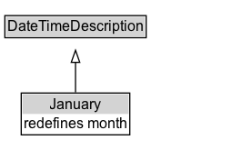

# January

## Diagram

=== "SVG (interactive)"

    <!-- Generated by graphviz version 14.1.3 (20260303.0454)
     -->
    <!-- Pages: 1 -->
    <svg width="199pt" height="132pt"
     viewBox="0.00 0.00 199.00 132.00" xmlns="http://www.w3.org/2000/svg" xmlns:xlink="http://www.w3.org/1999/xlink">
    <g id="graph0" class="graph" transform="scale(1 1) rotate(0) translate(4 128)">
    <polygon fill="white" stroke="none" points="-4,4 -4,-128 195.25,-128 195.25,4 -4,4"/>
    <g id="clust3" class="cluster">
    <title>cluster_associated</title>
    </g>
    <!-- DateTimeDescription -->
    <g id="node1" class="node">
    <title>DateTimeDescription</title>
    <g id="a_node1"><a xlink:href="../DateTimeDescription" xlink:title="&lt;TABLE&gt;">
    <polygon fill="lightgray" stroke="none" points="1,-97.88 1,-114.12 115.5,-114.12 115.5,-97.88 1,-97.88"/>
    <text xml:space="preserve" text-anchor="start" x="2" y="-101.88" font-family="Arial" font-size="12.00">DateTimeDescription</text>
    <polygon fill="none" stroke="black" points="0,-96.88 0,-115.12 116.5,-115.12 116.5,-96.88 0,-96.88"/>
    </a>
    </g>
    </g>
    <!-- January -->
    <g id="node2" class="node">
    <title>January</title>
    <g id="a_node2"><a xlink:href="../January" xlink:title="&lt;TABLE&gt;">
    <polygon fill="lightgray" stroke="none" points="14.5,-34 14.5,-50.25 102,-50.25 102,-34 14.5,-34"/>
    <text xml:space="preserve" text-anchor="start" x="36.88" y="-38" font-family="Arial" font-size="12.00">January</text>
    <text xml:space="preserve" text-anchor="start" x="15.5" y="-21.75" font-family="Arial" font-size="12.00">redefines month</text>
    <polygon fill="none" stroke="black" points="13.5,-16.75 13.5,-51.25 103,-51.25 103,-16.75 13.5,-16.75"/>
    </a>
    </g>
    </g>
    <!-- January&#45;&gt;DateTimeDescription -->
    <g id="edge1" class="edge">
    <title>January&#45;&gt;DateTimeDescription</title>
    <path fill="none" stroke="black" d="M58.25,-51.79C58.25,-59.25 58.25,-68.24 58.25,-76.69"/>
    <polygon fill="none" stroke="black" points="54.75,-76.54 58.25,-86.54 61.75,-76.54 54.75,-76.54"/>
    </g>
    <!-- Invis -->
    </g>
    </svg>

=== "PNG"

    

## Formalization for January

| Property | Constraint |
|----------|------------|
| [month](../properties/month.md) | value '--01' |
| [unitType](../properties/unitType.md) | value [unitMonth](http://www.w3.org/2006/time/unitMonth) |
| subClassOf | [DateTimeDescription](DateTimeDescription.md) |

## Other annotations

| Property | Value |
|----------|-------|
| [owl:deprecated](https://w3id.org/citydata/imported/owl/deprecated) | true |
| [skos:historyNote](https://w3id.org/citydata/imported/skos/historyNote) | This class was present in the 2006 version of OWL-Time. It was presented as an example of how DateTimeDescription could be specialized, but does not belong in the revised ontology.  |

