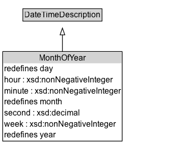

# MonthOfYear

The month of the year

NOTE: Membership of the class :MonthOfYear is open, to allow for alternative annual calendars and different month names.

## Diagram

=== "SVG (interactive)"

    <!-- Generated by graphviz version 14.1.3 (20260303.0454)
     -->
    <!-- Pages: 1 -->
    <svg width="272pt" height="212pt"
     viewBox="0.00 0.00 272.00 212.00" xmlns="http://www.w3.org/2000/svg" xmlns:xlink="http://www.w3.org/1999/xlink">
    <g id="graph0" class="graph" transform="scale(1 1) rotate(0) translate(4 208)">
    <polygon fill="white" stroke="none" points="-4,4 -4,-208 267.88,-208 267.88,4 -4,4"/>
    <g id="clust3" class="cluster">
    <title>cluster_associated</title>
    </g>
    <!-- DateTimeDescription -->
    <g id="node1" class="node">
    <title>DateTimeDescription</title>
    <g id="a_node1"><a xlink:href="../DateTimeDescription" xlink:title="&lt;TABLE&gt;">
    <polygon fill="lightgray" stroke="none" points="30.62,-177.88 30.62,-194.12 145.12,-194.12 145.12,-177.88 30.62,-177.88"/>
    <text xml:space="preserve" text-anchor="start" x="31.62" y="-181.88" font-family="Arial" font-size="12.00">DateTimeDescription</text>
    <polygon fill="none" stroke="black" points="29.62,-176.88 29.62,-195.12 146.12,-195.12 146.12,-176.88 29.62,-176.88"/>
    </a>
    </g>
    </g>
    <!-- MonthOfYear -->
    <g id="node2" class="node">
    <title>MonthOfYear</title>
    <g id="a_node2"><a xlink:href="../MonthOfYear" xlink:title="&lt;TABLE&gt;">
    <polygon fill="lightgray" stroke="none" points="1,-114.75 1,-131 174.75,-131 174.75,-114.75 1,-114.75"/>
    <text xml:space="preserve" text-anchor="start" x="53.38" y="-118.75" font-family="Arial" font-size="12.00">MonthOfYear</text>
    <text xml:space="preserve" text-anchor="start" x="2" y="-102.5" font-family="Arial" font-size="12.00">redefines day</text>
    <text xml:space="preserve" text-anchor="start" x="2" y="-86.25" font-family="Arial" font-size="12.00">hour : xsd:nonNegativeInteger</text>
    <text xml:space="preserve" text-anchor="start" x="2" y="-70" font-family="Arial" font-size="12.00">minute : xsd:nonNegativeInteger</text>
    <text xml:space="preserve" text-anchor="start" x="2" y="-53.75" font-family="Arial" font-size="12.00">redefines month</text>
    <text xml:space="preserve" text-anchor="start" x="2" y="-37.5" font-family="Arial" font-size="12.00">second : xsd:decimal</text>
    <text xml:space="preserve" text-anchor="start" x="2" y="-21.25" font-family="Arial" font-size="12.00">week : xsd:nonNegativeInteger</text>
    <text xml:space="preserve" text-anchor="start" x="2" y="-5" font-family="Arial" font-size="12.00">redefines year</text>
    <polygon fill="none" stroke="black" points="0,0 0,-132 175.75,-132 175.75,0 0,0"/>
    </a>
    </g>
    </g>
    <!-- MonthOfYear&#45;&gt;DateTimeDescription -->
    <g id="edge1" class="edge">
    <title>MonthOfYear&#45;&gt;DateTimeDescription</title>
    <path fill="none" stroke="black" d="M87.88,-131.76C87.88,-140.49 87.88,-149.05 87.88,-156.66"/>
    <polygon fill="none" stroke="black" points="84.38,-156.58 87.88,-166.58 91.38,-156.58 84.38,-156.58"/>
    </g>
    <!-- Invis -->
    </g>
    </svg>

=== "PNG"

    

## Formalization for MonthOfYear

| Property | Constraint |
|----------|------------|
| [month](../properties/month.md) | exactly 1 |
| [unitType](../properties/unitType.md) | value [unitMonth](http://www.w3.org/2006/time/unitMonth) |
| subClassOf | [DateTimeDescription](DateTimeDescription.md) |

## Other annotations

| Property | Value |
|----------|-------|
| [skos:editorialNote](https://w3id.org/citydata/imported/skos/editorialNote) | Feature at risk - added in 2017 revision, and not yet widely used.  |
| [skos:editorialNote](https://w3id.org/citydata/imported/skos/editorialNote) | Característica en riesgo - añadida en la revisión de 2017, y no utilizada todavía de forma amplia. |

