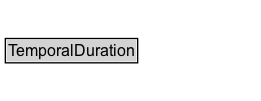

# TemporalDuration

Time extent; duration of a time interval separate from its particular start position

## Diagram

=== "SVG (interactive)"

    <!-- Generated by graphviz version 14.1.3 (20260303.0454)
     -->
    <!-- Pages: 1 -->
    <svg width="196pt" height="76pt"
     viewBox="0.00 0.00 196.00 76.00" xmlns="http://www.w3.org/2000/svg" xmlns:xlink="http://www.w3.org/1999/xlink">
    <g id="graph0" class="graph" transform="scale(1 1) rotate(0) translate(4 72)">
    <polygon fill="white" stroke="none" points="-4,4 -4,-72 191.62,-72 191.62,4 -4,4"/>
    <g id="clust3" class="cluster">
    <title>cluster_associated</title>
    </g>
    <!-- TemporalDuration -->
    <g id="node1" class="node">
    <title>TemporalDuration</title>
    <g id="a_node1"><a xlink:href="../TemporalDuration" xlink:title="&lt;TABLE&gt;">
    <polygon fill="lightgray" stroke="none" points="1,-25.88 1,-42.12 98.25,-42.12 98.25,-25.88 1,-25.88"/>
    <text xml:space="preserve" text-anchor="start" x="2" y="-29.88" font-family="Arial" font-size="12.00">TemporalDuration</text>
    <polygon fill="none" stroke="black" points="0,-24.88 0,-43.12 99.25,-43.12 99.25,-24.88 0,-24.88"/>
    </a>
    </g>
    </g>
    <!-- Invis -->
    </g>
    </svg>

=== "PNG"

    

## Specializations of TemporalDuration

| Class | Description |
|-------|-------------|
| [Duration Description](DurationDescription.md) | Description of temporal extent structured with separate values for the various elements of a calendar-clock system. The temporal reference system is fixed to Gregorian Calendar, and the range of each of the numeric properties is restricted to xsd:decimal |
| [Generalized Duration Description](GeneralDurationDescription.md) | Description of temporal extent structured with separate values for the various elements of a calendar-clock system. |
| [Temporal Unit](TemporalUnit.md) | A standard duration, which provides a scale factor for a time extent, or the granularity or precision for a time position. |
| [Time Duration](Duration.md) | Duration of a temporal extent expressed as a number scaled by a temporal unit |
| [Year](Year.md) | Year duration |

