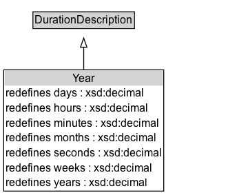

# Year

Year duration

## Diagram

=== "SVG (interactive)"

    <!-- Generated by graphviz version 14.1.3 (20260303.0454)
     -->
    <!-- Pages: 1 -->
    <svg width="270pt" height="212pt"
     viewBox="0.00 0.00 270.00 212.00" xmlns="http://www.w3.org/2000/svg" xmlns:xlink="http://www.w3.org/1999/xlink">
    <g id="graph0" class="graph" transform="scale(1 1) rotate(0) translate(4 208)">
    <polygon fill="white" stroke="none" points="-4,4 -4,-208 266.12,-208 266.12,4 -4,4"/>
    <g id="clust3" class="cluster">
    <title>cluster_associated</title>
    </g>
    <!-- DurationDescription -->
    <g id="node1" class="node">
    <title>DurationDescription</title>
    <g id="a_node1"><a xlink:href="../DurationDescription" xlink:title="&lt;TABLE&gt;">
    <polygon fill="lightgray" stroke="none" points="32.88,-177.88 32.88,-194.12 141.38,-194.12 141.38,-177.88 32.88,-177.88"/>
    <text xml:space="preserve" text-anchor="start" x="33.88" y="-181.88" font-family="Arial" font-size="12.00">DurationDescription</text>
    <polygon fill="none" stroke="black" points="31.88,-176.88 31.88,-195.12 142.38,-195.12 142.38,-176.88 31.88,-176.88"/>
    </a>
    </g>
    </g>
    <!-- Year -->
    <g id="node2" class="node">
    <title>Year</title>
    <g id="a_node2"><a xlink:href="../Year" xlink:title="&lt;TABLE&gt;">
    <polygon fill="lightgray" stroke="none" points="1,-114.75 1,-131 173.25,-131 173.25,-114.75 1,-114.75"/>
    <text xml:space="preserve" text-anchor="start" x="75.12" y="-118.75" font-family="Arial" font-size="12.00">Year</text>
    <text xml:space="preserve" text-anchor="start" x="2" y="-102.5" font-family="Arial" font-size="12.00">redefines days : xsd:decimal</text>
    <text xml:space="preserve" text-anchor="start" x="2" y="-86.25" font-family="Arial" font-size="12.00">redefines hours : xsd:decimal</text>
    <text xml:space="preserve" text-anchor="start" x="2" y="-70" font-family="Arial" font-size="12.00">redefines minutes : xsd:decimal</text>
    <text xml:space="preserve" text-anchor="start" x="2" y="-53.75" font-family="Arial" font-size="12.00">redefines months : xsd:decimal</text>
    <text xml:space="preserve" text-anchor="start" x="2" y="-37.5" font-family="Arial" font-size="12.00">redefines seconds : xsd:decimal</text>
    <text xml:space="preserve" text-anchor="start" x="2" y="-21.25" font-family="Arial" font-size="12.00">redefines weeks : xsd:decimal</text>
    <text xml:space="preserve" text-anchor="start" x="2" y="-5" font-family="Arial" font-size="12.00">redefines years : xsd:decimal</text>
    <polygon fill="none" stroke="black" points="0,0 0,-132 174.25,-132 174.25,0 0,0"/>
    </a>
    </g>
    </g>
    <!-- Year&#45;&gt;DurationDescription -->
    <g id="edge1" class="edge">
    <title>Year&#45;&gt;DurationDescription</title>
    <path fill="none" stroke="black" d="M87.12,-131.76C87.12,-140.49 87.12,-149.05 87.12,-156.66"/>
    <polygon fill="none" stroke="black" points="83.63,-156.58 87.13,-166.58 90.63,-156.58 83.63,-156.58"/>
    </g>
    <!-- Invis -->
    </g>
    </svg>

=== "PNG"

    

## Formalization for Year

| Property | Constraint |
|----------|------------|
| [years](../properties/years.md) | exactly 1 |
| subClassOf | [DurationDescription](DurationDescription.md) |

## Other annotations

| Property | Value |
|----------|-------|
| [owl:deprecated](https://w3id.org/citydata/imported/owl/deprecated) | true |
| [skos:historyNote](https://w3id.org/citydata/imported/skos/historyNote) | Year was proposed in the 2006 version of OWL-Time as an example of how DurationDescription could be specialized to allow for a duration to be restricted to a number of years. 

It is deprecated in this edition of OWL-Time.  |

